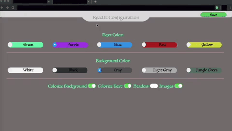

ReadIt
==========

Modifies the current tab by:

* Deleting all the images
* Deleting all the headers
* Changing the background color
* Changing the color of all the text on the page

depending on your decision.
